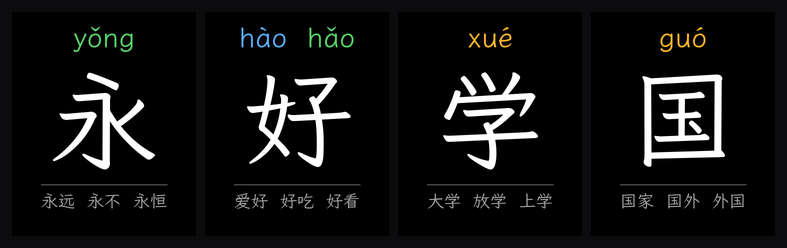
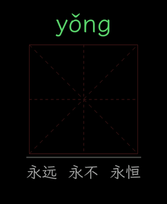
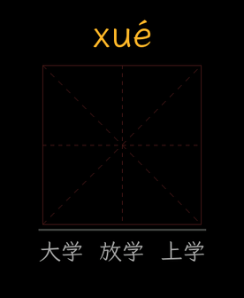

# 我给孩子做了一台查字机：喊一个字，它写给你看

孩子认字的时候最常问的一句是「这个字怎么写」。字典要先会查部首，手机一掏出来就不是查字了。
所以做了这个：**说出任意一个字，屏上就出现它** —— 拼音、组词，然后一笔一笔写出来，边写边念笔画名。

没有分组、没有关卡、没有课程表。就是查字典，只不过是喊的。

---

## 效果

| 永 | 学 |
|---|---|
|  |  |

暖黄色的是正在写的那一笔，写完转白。背后是小学练字本那种米字格。
念「横折钩」的时候横折钩正在长；念完停 600 毫秒，够孩子在本子上跟着写一笔。

> 上面两张图是**从设备数据逐像素还原的**，不是效果示意 —— 输入就是烧进 SD 卡的那两个文件。

---

## 三个让它看起来「对」的决定

### 1. 动画不自己画笔画，它放的是成品字自己的像素

常见做法是拿一套笔画轮廓数据（比如 makemeahanzi）直接渲染动画。
问题是：动画的字形和最终展示的字形来自两套东西，写完那一刻字会**跳一下**。

我反过来做。屏上最终那个字（霞鹜文楷渲染的 368×448 位图）是唯一的真相，
笔画数据只用来回答两件事 —— 「这个墨点属于第几画」「在这一画里排第几」。
动画就是把这个字自己的像素按书写顺序放出来。

于是：写完留在屏上的**就是**成品图本身，一个像素不差；抗锯齿的灰边原样保留，笔画边缘不毛。
代价是个别像素可能划给邻笔，肉眼看不出来。

这件事靠一条离线校验强制住：每个字各画像素的并集必须**恰好等于**成品图上全部非黑像素 ——
不缺、不多、不重复。2500 字全过。

### 2. 音和画必须是同一刻开始

音频是个队列 + 播放任务。天真的做法是「排进队列的那一刻开始画」，
但排进去的时候前一句往往还在响，画就跑到音前面去了，越到后面差得越远。

做法是：排这一画的音频**之前**，先轮询等队列放空；放空了再排、再开始画。
这样「排进去」和「开始响」就是同一刻，动画拿到的时长才是真的。第一画等的是字音和词组，
之后每一画等的是上一画的停顿。音频模块一行没改。

### 3. 一帧只推改动的那几行

整屏推送实测 21~29 ms。动画每帧只改字框里的几行 —— 按行推，**1~2 ms**。

---

## 硬件和数据

- **ESP32-S3 + 368×448 AMOLED**（Waveshare ESP32-S3-Touch-AMOLED-1.8），电容触摸：轻点唤醒，左右滑翻字
- **全程离线**：WakeNet 唤醒 + MultiNet 命令词识别都跑在芯片上。不联网、不上传、没有账号、没有订阅
- **2500 个常用字 × 14246 种说法**：每个字 6 种说法（「闪电的闪」「闪亮的闪」…），
  按最后一个音节分成 387 份查，全表 91 ms 建好
- **SD 卡 1.1 GB**：每字一张 368×448 RGB565 位图 + 字音 + 词组音 + 笔顺动画数据
- 笔顺动画 62 MB，自定义紧凑格式，最多 23 画
- 同一张卡同时喂两块板子（还有一版是 200×200 四色墨水屏），固件编译期切换

---

## 踩过的坑（给同行）

- **这块屏的电源和复位不在 GPIO 上，挂在 TCAL9534 IO 扩展器上。**
  厂商 BSP v2.0.3 里没有这段。不补就是彻底黑屏，而且**一条错误日志都没有** —— 所有接口都返回成功。
- **整屏 PSRAM 缓冲不能一次 `draw_bitmap`**：单次 SPI 事务上限 32 KB，而且 PSRAM 地址不是 DMA-capable。
  分成 32 行一条送。
- **makemeahanzi 的 y 轴朝上**（SVG 里带 `scale(1,-1)`），直接用会把笔顺上下颠倒 —— 「三」从下往上写。
  因为我的字形来自成品图，这个 bug 表现成「笔顺错了」而不是「字倒了」，反而更难发现。
- **jsdelivr 对超过 20 MB 的文件返回一段错误字符串，exit code 还是 0。** 用 raw.githubusercontent.com。
- **AMOLED 断电不保图**（墨水屏保），所以开机必须清掉 NVS 里记的「屏上已是某字」，否则首刷被跳过 = 开机白屏。

---

## 还没做

电源键和电量交给 AXP2101；字库进 flash，省掉 SD 上那 786 MB 位图。
